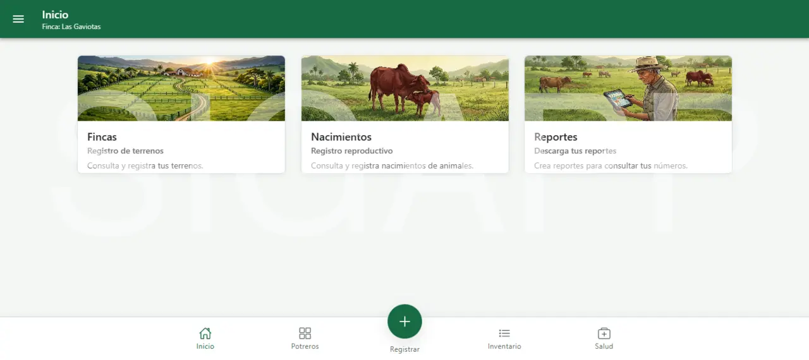
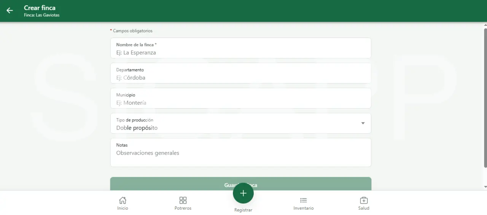
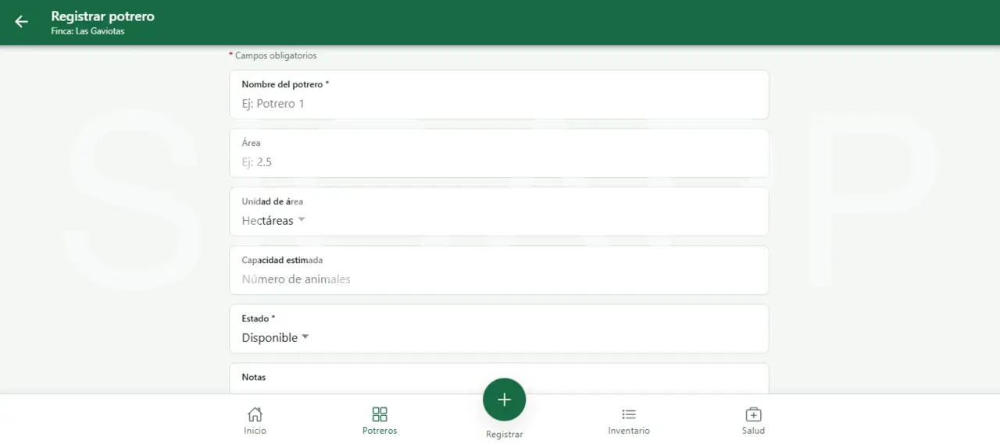
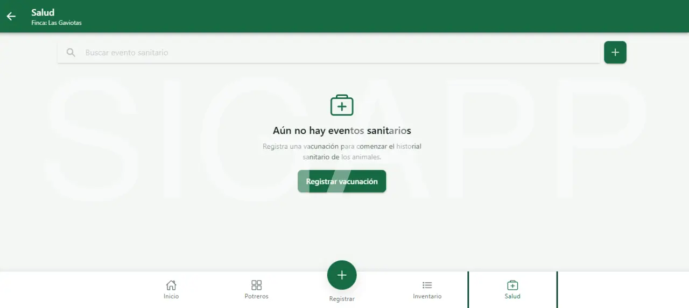
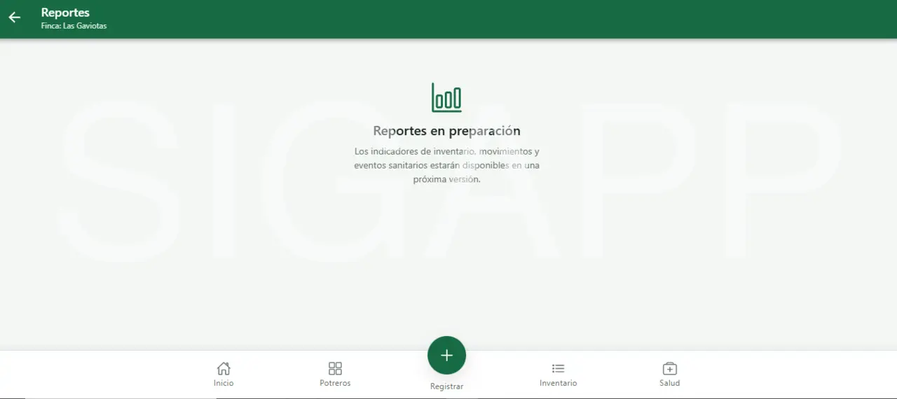
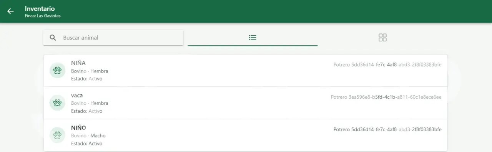
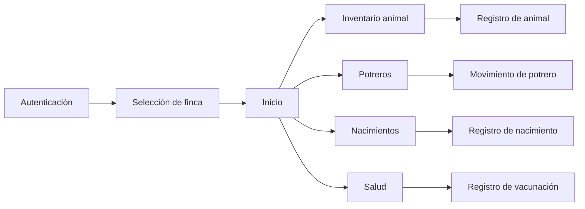
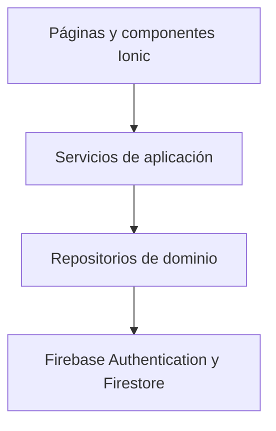

<p align="center">
  
</p>

<h1 align="center">SIGAPP</h1>

<p align="center">
  MVP multiplataforma para la gestión operativa de fincas ganaderas.
</p>

<p align="center">
  
  
  
  
  
  
</p>

## Descripción

SIGAPP es una aplicación web progresiva y Android creada para apoyar la
gestión básica de fincas ganaderas en Colombia y otros contextos tropicales.
Centraliza el registro de fincas, animales, potreros, nacimientos, movimientos
y eventos sanitarios en una experiencia adaptable a escritorio y móvil.

Este repositorio contiene la **edición pública de portafolio del MVP 1.0.0**.
El proyecto demuestra diseño de producto, arquitectura frontend, integración
con Firebase, aislamiento de datos y empaquetado móvil con Capacitor.

## Estado del proyecto

**MVP 1.0.0 finalizado y en etapa de validación beta.**

La versión actual está preparada para recibir retroalimentación de usuarios
reales. Los reportes avanzados, la distribución para iOS y las capacidades
comerciales quedan fuera del alcance de esta edición pública.

## Recorrido visual

<table>
  <tr>
    <td align="center"><strong>Acceso a la plataforma</strong></td>
    <td align="center"><strong>Inicio</strong></td>
    <td align="center"><strong>Gestión de fincas</strong></td>
  </tr>
  <tr>
    <td></td>
    <td></td>
    <td></td>
  </tr>
  <tr>
    <td align="center"><strong>Potreros</strong></td>
    <td align="center"><strong>Registro sanitario</strong></td>
    <td align="center"><strong>Reportes e indicadores</strong></td>
  </tr>
  <tr>
    <td></td>
    <td></td>
    <td></td>
  </tr>
  <tr>
    <td align="center"><strong>Inventario</strong></td>
  </tr>
  <tr>
    <td></td>
  </tr>
</table>

El flujo funcional principal del MVP es:



## Funcionalidades del MVP

- Inicio de sesión y recuperación de contraseña con Firebase Authentication.
- Creación, consulta y selección de una finca activa.
- Aislamiento de información por propietario y finca.
- Registro y consulta del inventario animal.
- Búsqueda de animales y vistas en lista o cuadrícula.
- Creación y consulta de potreros.
- Registro de movimientos de animales entre potreros.
- Registro y consulta de nacimientos con relación madre-cría.
- Registro y consulta de eventos sanitarios y vacunaciones.
- Acciones rápidas para los registros ganaderos más frecuentes.
- Estados de carga, listas vacías, errores y confirmaciones de usuario.
- Interfaz responsive para escritorio, tableta y móvil.
- Soporte PWA, favicon, manifiesto e iconografía adaptable.
- Proyecto Android generado con Capacitor y APK de prueba validado.

La sección de reportes está preparada visualmente, pero sus indicadores se
implementarán después de analizar la retroalimentación de la beta.

## Arquitectura

SIGAPP separa la interfaz, los casos de uso y el acceso a datos para reducir el
acoplamiento con Firebase.



```text
src/app/
|-- core/
|   |-- constants/
|   |-- guards/
|   |-- models/
|   |-- repositories/
|   |-- services/
|   |-- utils/
|   `-- validators/
|-- features/
|   |-- animals/
|   |-- auth/
|   |-- births/
|   |-- farms/
|   |-- health/
|   |-- home/
|   |-- inventory/
|   |-- paddocks/
|   `-- reports/
`-- shared/
```

### Decisiones técnicas destacadas

- Módulos funcionales con carga diferida.
- Componentes compartidos para formularios, estados de listas y navegación.
- Contrato `AppResult<T>` para respuestas controladas de la aplicación.
- Mensajes y etiquetas de dominio centralizados.
- Repositorios para evitar dependencias directas de Firestore en las páginas.
- Contexto de finca activa para mantener consistencia entre módulos.
- Limpieza de valores `undefined` antes de persistir documentos.
- Configuración local de Firebase excluida del repositorio.

## Seguridad y aislamiento

Firestore organiza la información operativa como subcolecciones de cada
finca. Las reglas verifican que el usuario autenticado sea el propietario de
la finca antes de permitir lecturas o escrituras.

```text
farms/{farmId}
|-- animals/{animalId}
|-- paddocks/{paddockId}
|-- births/{birthId}
|-- healthEvents/{healthEventId}
`-- paddockMovements/{movementId}
```

Las claves de cliente no se utilizan como mecanismo de autorización. La
seguridad de los datos depende de Firebase Authentication, las reglas de
Firestore y la validación del contexto de finca.

## Tecnologías

- Ionic 8
- Angular 18
- TypeScript 5
- Firebase 10
- Cloud Firestore
- Capacitor 6
- SCSS
- ESLint

## Ejecución local

### Requisitos

- Node.js 20 LTS.
- npm.
- Un proyecto web de Firebase.
- Para Android: JDK 17, Android Studio y Android SDK 34.

### Instalación

```bash
git clone https://github.com/darwindiaz/sigapp.git
cd sigapp
npm install
```

Crea los archivos locales de configuración a partir de los ejemplos:

```powershell
Copy-Item src/environments/environment.example.ts src/environments/environment.ts
Copy-Item src/environments/environment.prod.example.ts src/environments/environment.prod.ts
```

Completa `firebaseConfig` en ambos archivos y ejecuta:

```bash
npm start
```

La aplicación estará disponible normalmente en `http://localhost:4200`.

## Comandos útiles

```bash
# Desarrollo
npm start

# Análisis estático
npm run lint

# Compilación web de producción
npm run build

# Sincronización con Android
npx cap sync android
```

Para generar un APK de depuración en Windows:

```powershell
$env:JAVA_HOME = "C:\Program Files\Java\jdk-17.0.2"
$env:Path = "$env:JAVA_HOME\bin;$env:Path"
cd android
.\gradlew.bat assembleDebug
```

## Alcance y limitaciones

- La aplicación se encuentra en validación beta y no debe almacenar datos
  productivos sin una revisión adicional de seguridad y operación.
- Los reportes avanzados todavía no están implementados.
- La versión nativa para iOS requiere macOS, Xcode y firma de Apple.
- La cobertura automatizada se ampliará después de priorizar los resultados
  de la beta.
- Las capturas futuras del producto utilizarán exclusivamente datos ficticios.

## Próximos pasos públicos

- Incorporar capturas reales del recorrido con datos de demostración.
- Consolidar hallazgos de las pruebas beta.
- Priorizar correcciones de experiencia, accesibilidad y estabilidad.
- Publicar una demostración web controlada.

La evolución comercial y las nuevas funcionalidades de producto continuarán
en un repositorio privado independiente.

## Autor

Proyecto diseñado y desarrollado por
[Darwin Díaz](https://github.com/darwindiaz) como demostración de experiencia
en Angular, Ionic, Firebase, arquitectura frontend y desarrollo móvil híbrido.

## Licencia

Esta edición pública se distribuye bajo la licencia
[Apache 2.0](LICENSE). Consulta el archivo de licencia antes de reutilizar o
distribuir el código.
